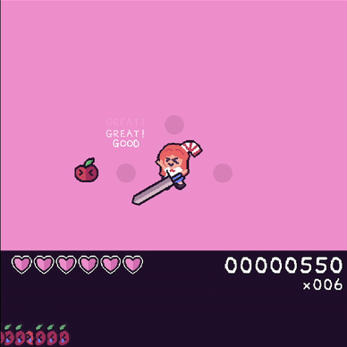

# Juicy Beat!

Hey! This is an early access version of Juicy Beat, a cutting apples rhythm
game. Juicy Beat offers playing Turkish March while using a giant sword for
cutting apples and making score!

It was made using KAPLAY. For charting it's using TJA (Taikojiro Sound Map), so
yeah, it's basically a Taiko with three buttons. I hope you enjoy it.

**REPORT BUGS**: https://github.com/lajbel/juicy-beat/issues

<a href="https://lajbel.itch.io/juicy-beat"></img></a>
